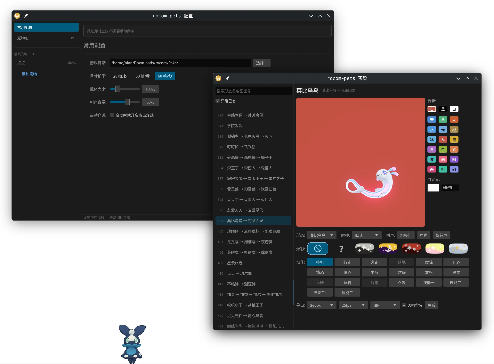

# rocom-pets

跨平台桌面宠物：把《洛克王国：世界》的宠物模型、动作与叫声做成本地生成的「宠物包」，
由一个原生运行时在桌面上播放与交互。宠物按需启用、可多只同时在场。

**当前状态:多只宠物可同时在场**——上桌待机/走动/奔跑/睡觉、鼠标交互(轮廓命中、受惊、摸头、
拖放,拎起的只是被点中的那只)、穿透开关、托盘里加一只/撤下/切形态且重启恢复阵容,
全量宠物包已导完(**201 个包 / 617 个形态**,1.7GB;按图鉴号归并,见
[docs/petindex.md](docs/petindex.md))。
宠物之间会互相注意到并打招呼、受惊会跑开,凑近了还会演一段跨宠互动
(珀尔鼬指挥捕尘长绒清扫)。声音**两层**:嗓子发出来的叫声(开心/震惊/惊恐/伤心/生气/
炫耀/放松/警觉/召唤九种情绪)加上身体动静的动作音效,受惊、摸头、睡醒、待机做表情、
配置窗口点动作时一起响;嗓音可调(游戏里那个 −100~100 的 `voice` 属性,只作用在叫声那层),
默认小声、托盘可静音,自己叫的那些一分钟至多一次。
**九条原始需求全部结掉**:Windows 后端也在实机上跑通了(2026-08-01)。
现在还有**独立的配置窗口**(`--settings`,托盘里也能开):管理宠物包(导入/查找/删除)、
管理在场宠物(加/撤,以及每只的形态/大小/性格/叫声/落脚点),改什么都即时生效;
运行时也**直接读 `.rkpet`**(zip)。
需求对照与后续计划见 [docs/design.md](docs/design.md) §9;**要动代码先看那份的
[「怎么改这个项目」](docs/design.md#怎么改这个项目)** —— 文档分工、逆向着色的六条规矩、
闸门怎么跑、渲染那几遍的顺序都在那儿。

| 文档 | 装什么 |
| --- | --- |
| [docs/design.md](docs/design.md) | 目标、技术选型、运行时架构、包格式、阶段计划、横向待办 |
| [docs/findings.md](docs/findings.md) | 着色 / 材质 / shader 的逐条实测记录(只增不改,含被推翻的结论) |
| [docs/findings-assets.md](docs/findings-assets.md) | 网格 / 动画 / 音频 / 命名 / 平台的实测记录 |
| [docs/shader.md](docs/shader.md) | 从 pak 取 shader → 认归属 → 反汇编 → 对语义的流水线 |

支持矩阵：**Windows 10+**(实机验过:上桌、置顶、点击穿透、拖放、托盘;
开发机是 Linux,靠交叉编译 + wine 冒烟 + 实机反馈来回磨)与
**KDE Plasma Wayland**(开发环境 Plasma 6.7.3 / kwin_wayland,日常在跑)。
GNOME 等不实现 wlr-layer-shell 的合成器不在支持范围，也不做 X11 回退。

KDE Plasma Wayland 运行截图：  


### 编译 rocom-pets(Linux)

要 [rustup](https://rustup.rs) 与 wgpu 跑 Vulkan 要的驱动(Mesa 或厂商驱动)。
配置窗口的文件对话框走 XDG portal,KDE 上由 `xdg-desktop-portal-kde` 提供 —— Plasma 自带。

```sh
cargo build --release          # → target/release/rocom-pets(21.8MB)
```

`[profile.release]` 开了 fat LTO + `codegen-units = 1` + `strip`:代码那部分 31.7MB → **18.0MB**,
代价是编译从 1m09s 涨到 2m46s。产物 **21.8MB**,差出来的 3.5MB 是烘进去的 13 张炫彩共享贴图
(`assets/glassy`,随仓库走,见下)。**去掉符号后崩溃回溯只剩地址** —— 要排查就用不带
`--release` 的 debug 档,那一档不受影响。

### 编译 rocom-pets.exe(Windows)

**在 Windows 上**(最省事):装 [rustup](https://rustup.rs) 与 Visual Studio Build Tools
的「使用 C++ 的桌面开发」(要 MSVC 链接器与 Windows SDK),然后

```sh
cargo build --release          # → target\release\rocom-pets.exe
```

**在 Linux 上交叉编译**(本仓库就是这么出的 exe,不需要 Windows 机器):

```sh
rustup target add x86_64-pc-windows-msvc
cargo install cargo-xwin                       # 自动取 MSVC 的 CRT/SDK 头与库
sudo pacman -S clang                           # 提供 lld-link(Arch;别的发行版装 lld)
PATH=/usr/lib/llvm*/bin:$PATH cargo xwin build --release --target x86_64-pc-windows-msvc
```

产物 `target/x86_64-pc-windows-msvc/release/rocom-pets.exe` **不需要 VC++ 运行库**
(`.cargo/config.toml` 里对这个目标开了 `+crt-static`),拷到 Windows 上双击即可,
除系统 DLL 外零依赖。体积在开 `[profile.release]` 的 LTO 之前量到约 19MB
(配置窗口那套 egui/winit 占了一多半,但换来的是不必再单独分发一个配置程序);
开了之后没在这台机器上重量过 —— 同一份改动让 Linux 的产物从 31.7MB 降到 18.0MB。
只想验代码能不能过编译器的话,`cargo check --target
x86_64-pc-windows-msvc` 就够(只要 std,连链接器都不用)。

**双击不会有黑窗口**(release 版按 GUI 子系统链接),但**从 cmd/PowerShell 里跑仍然有
日志** —— 启动时会挂回父进程的控制台。要看日志就 `set RUST_LOG=info` 再从命令行启动;
挂回去时 shell 已经回到提示符,日志会和提示符交错着刷,这是这类程序的通病。
debug 版(`cargo build` 不带 `--release`)保持控制台子系统。

宠物包不随 exe 走:把 Linux 上导好的包目录拷到 `%LOCALAPPDATA%\rocom-pets\packs\`,
或者用 `--packs-dir` 指过去;不给包也能起(调试精灵模式,用来验平台层)。

- 运行时(`src/`)：Rust + wgpu，自写平台窗口层(wlr-layer-shell / Windows `WS_EX_NOREDIRECTIONBITMAP` + DirectComposition)。
  两个后端都已跑通:平台层(透明置顶、轮廓命中、穿透开关)见 [docs/spike-s1.md](docs/spike-s1.md),
  骨骼动画 + toon 着色见 [docs/spike-s2.md](docs/spike-s2.md);
  行为、多实体、音频与配置窗口见 design.md §9 的 Phase 1–8。
  **这一层同时是个库**(`src/lib.rs`):跟平台无关的那 11000 行(渲染/动画/包格式/行为)
  另编一份 wasm 给下载站的预览用(`src/web.rs`),平台外壳按 `cfg` 排除。
- 外观变异(`src/pet/glassy.rs`)：游戏里那两种稀有外观都做了 —— **异色**(`MDT_SHINING`)
  是美术另做的一整套材质(蓝图的 `DiffMaterials` → `Yise/Mat/`),导出器一起导进包;
  **炫彩**(`MDT_GLASS`)是往原材质上开一个动态开关 `GlassySwitch` 再覆盖几个参数,
  照那条排列的 shader 汇编复刻(ID 门 → 折射 → 相对包围盒中心的屏幕 UV →
  `RedChannel×R + GreenChannel×G` → 按固有色亮度调制 → 星点层 → 整层替换)。
  **两者互不影响**,游戏里既有异色炫彩也有原色炫彩,所以配置窗口里是**两项**:
  「异色」一个开关(只对有那套美术的宠物出现),「炫彩」一排单选
  **无炫彩 / 黑白隐藏 / 常规炫彩 / 暗夜拾光 / 狂欢怪谈 / 铅字幻梦**,
  选了常规炫彩再挑配色与粒子(39 组 × 4 种 = 156 种,编号与游戏一致)。
  每个赛季的**传说精灵**穿自家赛季炫彩另走两条路(都不用玩家选的配色):加灵一家是
  **换一张铅绘基色贴图**;龙息帕尔与机幕方舟是 `FlowNoise` + `MixMask` 刷一层 ——
  哪儿变由美术那张每宠物一张的遮罩画定(前者只翅膀,后者身体与肩顶那圈银色扑克花纹)。
  玻璃层只刷在材质 `_M` 遮罩 alpha ≥ 0.4 的部位 —— 实机就是这样把鸭吉吉的喙与脚、
  白金独角兽的身体留在原色的,**这道门要重导包才有**(旧包会整片刷,运行时会提示)。
  炫彩的贴图是全库共用的(13 张 3.5MB),**在仓库里**(`assets/glassy`)、**桌面版构建时
  烘进二进制** —— 装好就能用,不必再摆一份素材目录;换台机器 `cargo build` 就够,
  **不必先备齐几十 GB 的游戏数据导一次包**(这是「仓库不含游戏素材」那条规矩的唯一例外,
  见末尾)。导出器正常导包时也会往 `<out>/glassy` 写一份,那份和仓库里的是同一批图。
  **网页预览那份 wasm 不烘**(那是点开才下的一个 chunk,3.6MB 让每个人先付一遍不值),
  改成挑到哪一款就取哪几张:常规炫彩两张约 250KB。
  机制、逆向过程与还没对上的那一档亮度差
  见 [docs/findings.md](docs/findings.md)「异色与炫彩:两件不同的事」。
- 导出器(`exporter/`)：C# + CUE4Parse，从自己的游戏 pak 生成宠物包;
  **一个图鉴号一个包**(`076-海盔虫.rkpet`,glb 含全部动作 + 贴图 + 叫声 + manifest.toml),
  归并规则与全量清单见 [docs/petindex.md](docs/petindex.md),结构见 [docs/spike-s3.md](docs/spike-s3.md)。
  `--index` 只列包名不碰 pak(和 `tools/petindex.py` 对账用);
  `--zip` 额外打一个 `.rkpet`、`--zip-only` 打完就删掉包目录,运行时两种都直接读。
  动画按**场景类别前缀**挑(`World_` 大世界 > `Common_` > … > `Ride_` 骑乘),
  `--probe-anim <资产>` 打印某只的骨架、重定向模式、轨道映射与各段动画的异常平移、
  `--probe-anim ALL` 全库普查撞名 —— 待机取到骑乘那一版就是这么查出来的
  (findings-assets.md「待机取到了骑乘那一版动作」);`--probe-anim <资产>:<动作>` 把那一段逐根骨骼摊开。
  **上游 ACL 解码会把轨道接错骨骼**,三条修正:轨道数少于骨骼数却报恒等映射的,
  换用同资产别的动作带的真映射;借不到就按「整批一致」推断错位量;而**缩放那一路不跟着错位走**
  (ACL 三个分量各自剔恒定轨道,道具骨的缩放没被剔)。再加一道只报不改的哨兵:
  有肉的骨骼被恒定挪出绑定姿势就在包里记一行。细节见 findings-assets.md「上游 ACL 解码把轨道接错了骨骼」。
  自己没有 `Animation/` 的形态**按「网格挂的是谁的骨架」去借**(其次同 `anim_conf`、
  最后同族):同一份骨架才保证骨骼名与参考姿势逐根对得上。借到别人的骨架上会**一半对一半不对**
  ——`Bip001-*` 是通用命名,猫狗鸟鱼都叫这个 —— 于是身体按对方的骨骼长度缩掉、尾巴帽子僵在
  绑定姿势(findings-assets.md「黑猫巫师身体偏短、尾巴笔直」)。
  音频要 `vgmstream-cli` 与 `ffmpeg`(缺了自动跳过,`--no-audio` 显式关):
  叫声取 `Pet_Vo_<拼音>.bnk`、动作音效取 `Pet_Action_<拼音>.bnk`,两族库对同一批情绪
  各有一套且**内容不同**(包络相关只有 0.11~0.42,见 findings.md §1.1)。
  全库 617 个形态里 **533 个有声音**(叫声 511、音效 529),音频合计 141MB。
- 下载站(`web/`)：应用本体与宠物包的下载页,整站在 Cloudflare 上 ——
  Workers 出页面并接管 `/api/*`、R2 存文件、D1 记下载与异常标记次数、KV 按 IP + 日期去重防刷。
  卡片上的「预览」点开能**在浏览器里直接看这只宠物**:同一份渲染代码编成 wasm,
  可换形态与眼神、点按钮做动作、拖着转视角,还能挑**异色**与**炫彩**(和桌面版同一张配置表、
  同一套写法),并把**眼前这一身**连同正在播的那段动作**存成 GIF 表情包**
  (画布上有取景框,240/360/512 三种尺寸、20/25/50 三档帧率、透明或纯色背景,一整个动作循环)。
  点开才加载(wasm 单独一个 chunk,`.rkpet` 按 HTTP Range 只取当前形态,
  炫彩共享贴图挑到哪款取哪几张,GIF 编码器也是点了才下),要 WebGPU。
  头像自己从解包数据拼(游戏自带的 `Icon/HeadIcon/<conf_id>.png`,按 id 直接对上
  manifest 里的形态,不引外部仓库的成品图),搜索认图鉴号、链首名与**包里任何一个形态名**。
  目录(`catalog.json`)由 `web/scripts/gen_catalog.py` 扫包目录生成 —— 算 sha256、
  读 manifest 取形态构成,和素材一样是生成物、不入仓库。部署见 [web/README.md](web/README.md)。
- 验证工具(`tools/`)：`verify_glb.py` 按 glTF 规范自采样 + 蒙皮 + 光栅化，渲图肉眼核对动画正确性;
  `sweep.py` 是**回归闸门** —— 全库每个形态渲一格,统计「失败 / 空白 / 过曝」三个数,
  改着色或改导出器之后跑一遍,三个数都不许变差;`cmp_shots.py` 拿实机截图对照渲图给出差距数字
  (抠图那步在 `gamemask.py`,取最大连通块)。三个都要素材,而素材不入仓库,
  路径见各自文件开头的说明。
- shader 逆向(`scripts/`)：cooked 包里材质图被剥了、只剩参数值与静态开关,而编译产物里公式是全的、
  静态开关也已定死。这批脚本把公式从 shader library 里读出来 ——
  Windows 端走 DXBC(`shaderdump.py` 取码、`dxbcdis.c` 反汇编、`dxbcsig.py` 对语义、
  `matshader.py` 认归属、`uniexpr.py` + `matparams.py` 把 cb 槽位对回参数名),
  安卓端走 GLSL 源码(`glsldump.py`,好读得多)。
  流水线与结论见 [docs/shader.md](docs/shader.md) 与 [docs/android-glsl.md](docs/android-glsl.md)。
  安卓那条路原本卡在**归属**(APK 里有 shader 却没有宠物资产,只能靠结构指纹猜);
  宠物资产在手机的**应用私有目录**里,`adb root` 取到之后归属变成精确哈希查表,
  见 [docs/android-device.md](docs/android-device.md)。

### 打包:目录或 `.rkpet`

包可以是**解开的目录**,也可以是导出器打出来的 `.rkpet`(zip;喵喵链 13.6MB → 7.1MB)。
运行时两种都直接读,不解压到临时目录 —— 包内相对路径拼在包的位置后面当「虚拟路径」用,
真读的时候由 `src/assets.rs` 判断要不要开归档(见那个模块的说明)。
包目录里两种可以混着放,`--list` 会在归档那几行标 `[rkpet]`。

```sh
dotnet run --project exporter -- --species 3001 --out packs --zip       # 目录 + .rkpet
dotnet run --project exporter -- --all --zip-only --skip-existing --out packs  # 全量,只留归档
```

**全量导出用 `--zip-only`**:`--zip` 会把包目录和归档**两份都留着**,全库就是
3.3GB + 2.0GB;`--zip-only` 打完即删源目录,只剩 2.0GB(25 条链抽样量的压缩比 0.61)。
`--skip-existing` **认得 `.rkpet`**,所以只留归档照样能分批续跑。

压缩级别用的是默认档,量过之后**没有调**:换 `SmallestSize` 只小 0.3% 而耗时多 57%;
把已经压过的 png/ogg 改成仅存储反而更大(deflate 还能从 PNG 里再挤出一点)。
体积的大头是 glb(全库 2008MB,占 63%),png 1121MB、ogg 31MB —— 真要再小得换
KTX2 贴图,那是另一件事(见 design.md 横向待办)。
归档必须是 **deflate 或 store**:运行时的 `zip` crate 只链了 `deflate-flate2`。

### 配置

配置在 `~/.config/rocom-pets/config.toml`(首次运行生成带注释模板),
**在场阵容存在同目录的 `roster.toml` 里**(每改一次就整份重写,所以没和手写的 config.toml
混在一起),下次启动自动恢复;给了 `--pack` 则只上这一只、不动存档。

**托盘菜单**只放菜单表达得了的东西 —— 文字、勾选、单选、子菜单、分隔线:

```
✓ 点击穿透 / ✓ 静音叫声 / 召回宠物
─────
帧率设置 ▸   20 / 30 / 60 帧每秒
大小倍率 ▸   50% / 100% / 150% / 自定义…
叫声音量 ▸   静音 / 30% / 60% / 100%
─────
首选项       ← 开配置窗口(落在「常用配置」页)
重新载入
退出
```

**菜单里没有滑块**,所以连续量(124%、37%)在这里降级成几个档位,精确值只在配置窗口里
存在;不在任何一档上时菜单**一个都不勾**,而不是硬勾一个最近的。加/撤宠物、切形态那些
要先列阵容再逐只展开的操作也不在托盘里 —— 菜单一深就没法用,顶层留一条「首选项」。
那三组档位**各自摆在顶层**而不是收进一个「常用配置」里:套一层的话调个音量要点两次
才看得见选项,而这三样正是最常调的。
在场只数不占菜单里的一行(那是条点不动的字),它在图标的悬停提示里。

「帧率设置」是**目标帧率**:台上在干什么都按它推进。这里曾经按姿势变化速度自动降频
(睡着的宠物落到 10Hz),取消了 —— 省下的那点 CPU 换来的是「什么时候降、降到多少」
全凭它自己判断,而帧率是用户看得见、也说得出偏好的东西。

**配置窗口**(`rocom-pets --settings`,或托盘里那两条)是一个独立进程,900×620,
左边是导航、右边是内容:

- **宠物包**:表格(名称写成整条进化链「喵喵 → 喵呜 → 魔力猫」、形态数、体积、
  `rkpet`/目录)、搜索、导入、上桌、删除。导入是**两个按钮**(「导入包…」选 `.rkpet`、
  「导入目录…」选解开的包目录)—— 原生文件对话框没有「文件和目录都行」这个模式。
  **没有文件拖放**:winit 0.30 的 Wayland 后端没实现它(x11 与 windows 后端有),
  与其在一个平台上能用、另一个平台上默默没反应,不如两边都只留这两个按钮;
- **活跃宠物**:侧栏逐只展开,每只可改形态、**异色**开关与**炫彩**(见上)、大小、
  性格、参与叫声(嗓音是个能打字的数值框,−100~100,旁边一个「重掷」)、记住上次落脚点;
  底下是这只的**动作表** —— 一格一个动作,
  这个形态没有的置灰,**点一下就在桌面上当场播一次**;
- **常用配置**:目标帧率、整体大小、叫声音量、启动就穿透。

大小与音量都是**滑杆 + 右边一个能直接打字的数值框**,两边盯着同一个值;
嗓音只有数值框(它没有「大概多大」这种直觉,滑杆帮不上忙)。
打进去超范围的数会自动夹回上下限。大小一律写成百分比(150% 而不是 1.50×)——
「1.50×」要在脑子里换算一次才知道是「大了五成」,而托盘里那三档本来就写着百分比。

**「眼神」与「表情」是两套词**,两端的界面与文档都按这个口径:*眼神* = 脸那张图集里的
一格(默认/微笑/惊讶/生气/困倦/哭哭/闭紧/晕眩);*表情* = Happy/Sad 那几段**动作**
(开心/放松/炫耀/生气/伤心/惊恐)。动作那几个中文名照抄游戏的 `LLM_PET_BEHAVIOR_CONF`。

**性格决定眼神,不用手工勾**。规则是从解包数据里搬的:游戏的 `NATURE_CONF` 里每条性格
带一个 `emotion_desc`,31 条里只有 6 条不是「默认」—— 天真/开朗→微笑、懒散/悠闲→困倦、
胆小→哭哭、急躁→生气。**眼神落在眼睛上**:眼睛与嘴各是一张 2×4 的眼神图集
(`M_P_Eyes` 那族材质),网格 UV 落在左上那格,换眼神就是整格地偏一下 UV。
八格逐个渲出来和三方攻略里那张「幽星光不同性格的眼睛」比对过,五种脸一一对上;
配置表里没名字的那三格里,「晕眩」用游戏行为表 `dizzy` 的官方词,「惊讶」「闭紧」
照着美术给形变目标起的名(`Jing` 惊 / `Shou` 收)起 —— 第七格原来叫「大笑」是误读。
少数几只(21 片脸网格,乖乖鹄一家在内)是**另一种做法**:八种眼神各做一份几何叠在一起,
卡号写在顶点色里,换眼神 = 只画其中一张(见 findings.md「网格脸」那节)。
**做动作的时候脸也跟着换,而且是照游戏的数据换的**:每段动画自己带一条条曲线
`EC_Eye`(眼)、`EC_Mouth`(嘴)、`EC_Dynamic1..3`(别的脸槽),值就是「图集第几格」
——全库 23557 段动画里 97.1% 带 `EC_Eye`。所以各个脸槽**各走各的**
(幽星光受惊时是眼第 3 格、嘴第 7 格;幽影树放松时是眼第 6 格、两颗球第 4 格;
一窝蜂身上两只蜜蜂各一张脸),
而且是**逐帧**的 —— 待机段里那条曲线在「默认」和「闭眼」之间来回跳,那就是眨眼。
性格给的那张脸是曲线说「默认」时它的样子。
还有一批(全库 37 个资产)的嘴**根本不是贴图**:里奥就没有嘴的图集槽,
它的嘴是本体网格上的七个形变目标(喜/惊/怒/睡/哀/收/晕),权重同样由动画曲线驱动。
细节见 findings.md「眼神一直是猜的 —— 它写在动画曲线里」那节。
性格还顺带定了它爱做哪几个表情动作(`LLM_PET_BEHAVIOR_CONF` 里 84 条行为各自标着
「哪几种性格会做」,反过来读)。游戏里 31 条性格,桌宠只留**七条**,按「脸 + 动静」
两条轴挑到不重复:五种脸各一个代表,默认脸那几条再留下差得最远的三个
(平和 = 基线、调皮 = 最闲不住、冷静 = 最能睡)。名字与 `nature_id` 都是游戏里的,
见 `src/persona.rs`。配置窗口的下拉框里**换脸的那几条连眼睛一起写**
(`胆小「哭哭眼」`),七条一屏排开、不用滚 —— 挑性格多半正是冲着那张脸去的。
默认脸的不写后缀:那是「没有变化」的一档,标出来反而看不见真正带脸的是哪几条。

**改什么都即时生效**,没有「保存」按钮:桌宠是看得见的,盯着屏幕就知道对不对。
顶上那条常驻:没改动时说「改动即时生效,不需要手动保存」,改过之后说「已修改 N 项」并提供**撤销**
(回到打开窗口时那一份)。**它一直在那儿、高度也不变** —— 改动出现时才冒出来的话,
底下整页会往下跳一截,而正在拖的那根滑杆就在这页上,手还按着。
唯一的例外是滑杆与那个数值框 —— 拖的时候只动数字,松手(或输入框提交)才落盘,
否则每帧都在重建宠物。

两个进程之间**只靠 `config.toml` + `roster.toml`** 对话,改完发一条 `Reload`;
桌宠没在跑的话改动下次启动照样生效。手改完文件想立刻生效就 `rocom-pets --reload`。
反方向只有一句话:托盘点「退出」(或 `rocom-pets --quit`)时,配置窗口也跟着关 ——
桌宠都没了,剩一个窗口对着不存在的宠物调大小没有意义。喊话用的就是配置窗口
占单实例的那个凭据(Linux 是 D-Bus 名字、Windows 是具名内核对象),不另起一套。

窗口里的中文字体是**从系统里找的**(Linux 问 fontconfig 要能写简中的那一份**与字面下标**,
Windows 找雅黑/黑体),不打进二进制:一份中文字体比整个运行时还大。

**没有内置的全局热键**:要快捷键就在系统里把自定义快捷键绑到
`rocom-pets --toggle-passthrough`(还有 `--recall` / `--reload` / `--quit`)。
键位归系统管,桌宠一个组合键都不抢,也就不会和别的程序打架 ——
原来那条 XDG GlobalShortcuts portal 的路(要桌面实现 portal、要用户点授权弹窗)去掉了。
配置里认不得的键(包括老版本留下的 `hotkey` / `hotkey_recall`)会**直接报错**而不是
被忽略 —— 拼错了要让人看见;删掉 config.toml 就会重新生成一份带注释的。

```sh
cargo run --profile fast -- --pack packs/喵喵                # 把宠物放到桌面上(迭代用这档)
rocom-pets --settings --page pets                          # 打开配置窗口(pets / packs / common)
rocom-pets --list                                          # 列出 ~/.local/share/rocom-pets/packs 里的包
rocom-pets --pack 喵喵                                      # 按包名启动(目录、.rkpet 路径也行)
rocom-pets --toggle-passthrough                            # 通知已在跑的实例(可绑快捷键)
rocom-pets --reload                                        # 手改完 config/roster 后让它重读
cargo run                                                  # 同上但用调试精灵(平台层验收模式)
# `--profile fast` = release 的优化 + 能并行的 LTO:改一行重编 23 秒 vs release 的 1 分 38 秒
# (代价是二进制大 3.4MB)。**出包仍然用 `--release`**,体积那一档在发布里要算。
cargo run --profile fast -- --render packs/喵喵 --bench 600  # 离屏渲宠物 + 测出帧耗时
git -C "$CUE4PARSE_DIR" apply exporter/patches/*.patch      # 导出前必做:修上游顶点色 / 标量参数名 / lua 头三处
dotnet run --project exporter -- --species 3001 --out packs # 导一条进化链
dotnet run --project exporter -- --all --zip-only --skip-existing --out packs  # 全量导(可分批续跑)
dotnet run --project exporter -- --glassy --out packs       # 只导炫彩共享贴图(正常导包时本来就会写)
python tools/verify_glb.py packs/喵喵 --clips Idle,Walk     # 渲图验证
uv run --with numpy --with pillow python tools/sweep.py    # 回归闸门:全库三个数不许变差
uv run --with lz4 python scripts/glsldump.py <安卓 shader 库> --index   # shader 逆向(见 docs/shader.md)
```

资产提取链路在 [rocom-capture](../rocom-capture) 里验证;音频那条(bnk → 事件 → wem)的
原理由 [rocom-petvo](../rocom-petvo) 先跑通,这里是照着原理自己实现的一份 ——
**不引它的代码,也不用它的成品资源**。

素材版权属原发行方：**本仓库只有代码与导出器,不包含也不分发宠物包**,需自备游戏安装在本地生成。
**唯一的例外是 `assets/glassy` 那 13 张(3.5MB)炫彩共享贴图** —— 它们不属于任何一只宠物,
却卡着「不导包就编不出完整二进制」这一步,所以随仓库走。运行时不读游戏内存、不注入进程、不联网。
